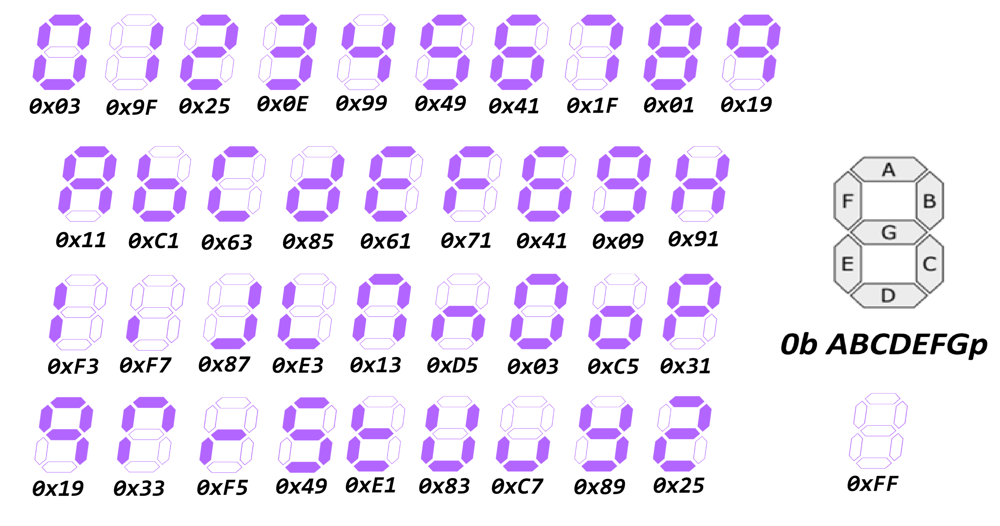

# Display 7 Segmentos ánodo común
<!-- [ CERN oficial IPbus documentation](https://ipbus.web.cern.ch/doc/user/html/index.html "IPbus documentation") -->

## Introducción
---
El display de 7 segmentos es muy conocido por lo que no se expondrá mas teoría sobre su funcionamiento. 

Los valores que se muestran en la siguiente imagen son aquellos con los que cuenta el código de la libreria. Recuerde los detalles importantes:

- El valor 0 representa prendido y 1 apagado. 
- El bit más significativo (#7) representa al segmento A. El segmento B corresponde al bit #6 y asi sucesivamente, (se muestra en la imagen en color gris).
- El punto decimal es el bit menos significativo y siempre esta apagado.   

---

  

---

[ Aqui pueden ver los videos en orden. ](https://www.youtube.com/watch?v=4Slq3BqHL1w&list=PL3E9VJdKIfILVzbyptj5JNysUtyaPjuel  "ILista microcontroladores.")

[ Aqui pueden ver la práctica del display.](https://www.youtube.com/watch?v=4McbrY2Yh8E&list=PL3E9VJdKIfILVzbyptj5JNysUtyaPjuel&index=4  "ILista microcontroladores.")

[ Aqui pueden ver la expliación de la libreria. ](https://www.youtube.com/watch?v=4Slq3BqHL1w&list=PL3E9VJdKIfILVzbyptj5JNysUtyaPjuel  "ILista microcontroladores.")

---

* [Regresar a la página principal](../ "Return")
<!-- 
* [Teclado matricial 4x4](./RAMs/ "Go to RAMs documentation")
 
* [Counters](./Counters/ "Go to Counters documentation")
-->

