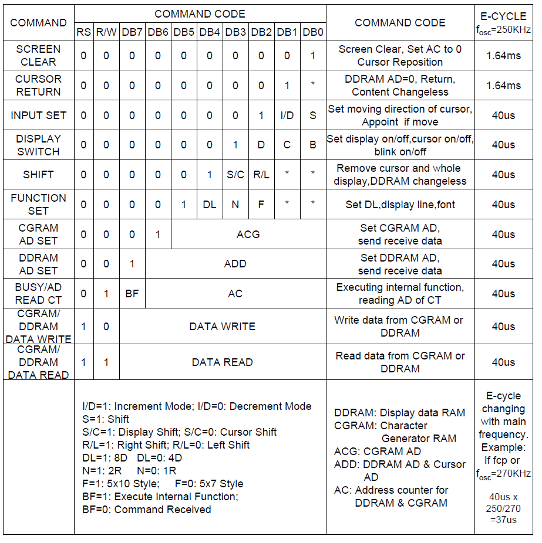
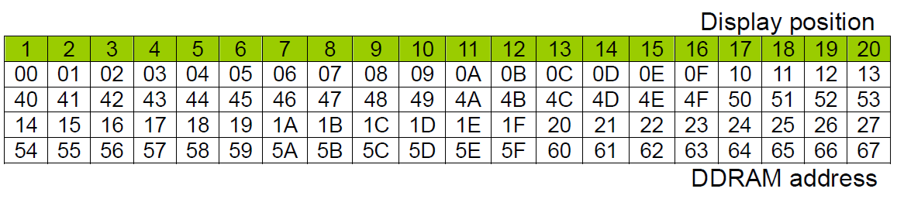

# LCD (Hitachi HD44780 LCD controller)

## Introducción
---
La libreria que se explica es tomada de las PLib de Microchip. Está basada en el controlador HD44780 para LCD. 

 **Recuerden definir las sigueintes 4 cosas antes de utilizar la libreria:** 

 
 
 *          - The LCD interface type (4- or 8-bits)
 *          - If 4-bit mode
               - whether using the upper or lower nibble
 *          - The data port
               - The tris register for data port
               - The control signal ports and pins
               - The control signal port tris and pins
 *          - The user must provide three delay routines:
               - DelayFor18TCY() provides a 18 Tcy delay
               - DelayPORXLCD() provides at least 15ms delay
               - DelayXLCD() provides at least 5ms delay

---
---
---

**Las funciones/comandos a los que responde la LCD**

  

---
---
---

**Direcciones para posicionar el cursor en una LCD de 20x4.  ** Recuerden que para una LCD de 16x2 solamente los dos primeros renglones son válidos. 

  

---

[ Aqui pueden ver los videos en orden. ](https://www.youtube.com/watch?v=4Slq3BqHL1w&list=PL3E9VJdKIfILVzbyptj5JNysUtyaPjuel  "Lista microcontroladores.")

[ Aqui pueden ver la expliación de la LCD. ](https://www.youtube.com/watch?v=2iui__WIAIo&list=PL3E9VJdKIfILVzbyptj5JNysUtyaPjuel&index=10 "Lista microcontroladores.")

[ Aqui pueden el ejemplo para usar la libreria. ](https://www.youtube.com/watch?v=tdhLc9YcCT0&list=PL3E9VJdKIfILVzbyptj5JNysUtyaPjuel&index=11 "Lista microcontroladores.")

---

* [Regresar a la página principal](../ "Return")