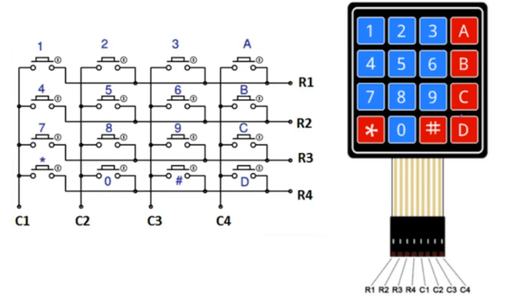

# Teclado matricial 4x4

## Introducción
---
Las distribución de renglones/columnas se muestran en la siguiente imagen, de la misma manera, se aaprecia su conexión con los correspondientes pines del teclado matricial. 

 **Recuerden cambiar el valor de LATx/PORTx en el archivo de cabecera** *keypad4x4.h* 
 ---

  

---

[ Aqui pueden ver los videos en orden. ](https://www.youtube.com/watch?v=4Slq3BqHL1w&list=PL3E9VJdKIfILVzbyptj5JNysUtyaPjuel  "ILista microcontroladores.")

[ Aqui pueden ver la práctica del teclado.](https://www.youtube.com/watch?v=qxIJar6CH2U&list=PL3E9VJdKIfILVzbyptj5JNysUtyaPjuel&index=5  "ILista microcontroladores.")

[ Aqui pueden ver la expliación de la libreria. ](https://www.youtube.com/watch?v=tdhLc9YcCT0&list=PL3E9VJdKIfILVzbyptj5JNysUtyaPjuel&index=7 "ILista microcontroladores.")

---

* [Regresar a la página principal](../ "Return")